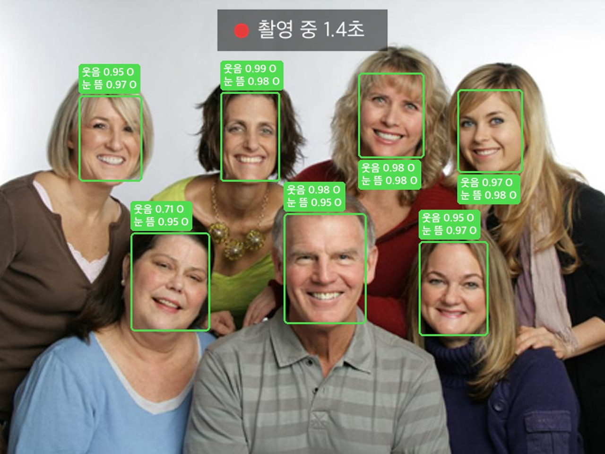
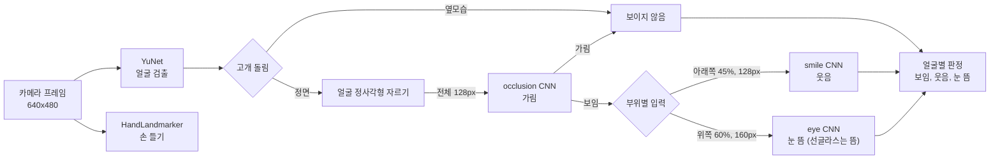
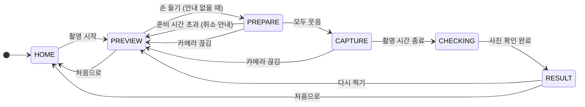
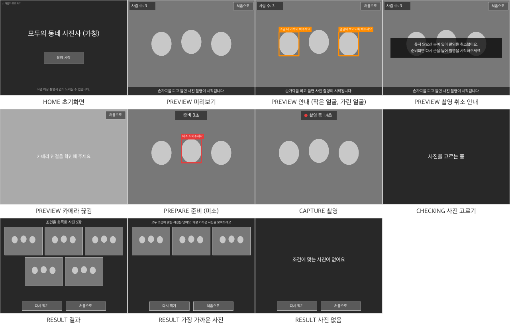

# 순간포착!

## 프로젝트 개요



- 판정 예시: yunet_cnn v0.0.7, 사진 WIDER FACE

모두가 웃고, 아무도 눈을 감지 않은 단체 사진을 찍어 주는 앱.

- 개발 배경: 단체 사진을 잘 찍기는 늘 어려움. 한 명쯤은 미소 짓지 않고, 한 명쯤은 눈을 감음
- 구현 방법: CNN 모델로 웃는 얼굴과 감은 눈을 검출
- 성능 요구사항
    - 추론 성능 및 추론시간 베이스라인 모델 이상
    - MedaiPipe FaceLandmarker의 blendshape 점수를(웃음: 입꼬리 울라감, 눈 뜸: 눈 열림) 기반으로 베이스라인 모델 구축. 웃거나 눈을 감을 때, 변화하는 대표적인 얼굴의 지점을 정량화하여 점수를 계산.
- 개발 결과 (모델 v0.0.7)

| 항목 | 베이스라인 | 개발 결과 | 목표 달성 여부 |
|---|---|---|---|
| 눈 판정 AUC | 0.893 | **0.947** | 달성 |
| 웃음 판정 AUC | 0.933 | 0.902 | 미달 |
| 균형 정확도* | 0.691 | 0.720 | 달성 |
| 추론 시간 P90 | 289ms | 131ms | 달성 |

- 구동 환경: 라즈베리파이에서 앱을 실행하고, LAN 으로 연결한 로컬 PC 화면에 UI 를 띄움 (X 서버)
- 테스트 환경: Docker 로 라즈베리파이와 같은 환경을 구성
- 사용 기술: Python, LiteRT, OpenCV / 협업: git, Google Drive

## 모델 설계

- CNN 모델 백본: MobileNetV3Samll
- 얼굴을 부위별로 나누어서 입력으로 사용.
- 상태별로 필요한 모델만 사용함.
- 베이스라인 (`yunet_landmark`): YuNet + MediaPipe FaceLandmarker blendshape 규칙
- 자세한 내용: `docs/dev_spec.md` 4절, 기준값 근거 10절, 버전별 성능 `docs/model_versions.md`

## UI/UX

### 화면 예시



- `app/photo_app/wireframe.py` 로 생성 (카메라 없이 더미 화면)

## 디렉토리 구조

```
app/          앱 (UI, 상태 관리, 카메라, 모델 추론). 모델 파일 app/models/
training/     CNN 학습 노트북 (Colab), 학습 데이터 준비 스크립트
evaluation/   평가: WIDER 단체 사진 정확도, 라즈베리파이 속도, CPU/메모리
data/         데이터 출처, 라벨 정보 (데이터 파일은 팀 드라이브)
docs/         요구사항 (biz_spec), 설계 (dev_spec), 모델 버전 기록 (model_versions), git 규칙
notebooks/    Colab 훈련 노트북 파일
```

- 실행 방법: `app/README.md`
- 학습: `training/README.md`, 평가: `evaluation/README.md`

## 팀원

| 이름 | 역할 | GitHub |
|---|---|---|
| 조수영 | 데이터셋 수집 및 전처리 | https://github.com/kcci-AI-campus/39_JSY  |
| 조원영 | 팀장 | https://github.com/kcci-AI-campus/40_WYCHO |
| 하기범 | 웃음 모델 학습 | https://github.com/kcci-AI-campus/43_HKB |
| 한상훈 | 눈 모델 학습 | https://github.com/kcci-AI-campus/44_HSH |
